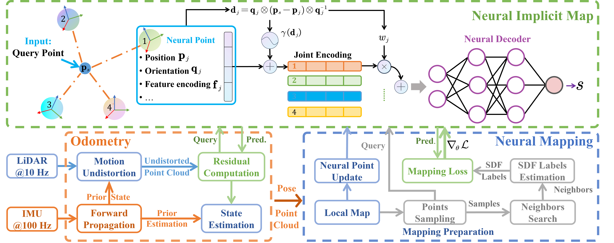

# <div align = "center">CLID-SLAM:</div>
### <div align = "center">A Coupled LiDAR-Inertial Neural Implicit Dense SLAM With Region-Specific SDF Estimation</div>

<div align="center">
  <a href="https://github.com/DUTRobot/CLID-SLAM/releases"></a>
  <a href="https://ieeexplore.ieee.org/abstract/document/10884955"></a>
  <a href="https://github.com/DUTRobot/CLID-SLAM"></a>
  <a href="https://github.com/DUTRobot/CLID-SLAM"></a>
  <a href="https://github.com/DUTRobot/CLID-SLAM/blob/main/LICENSE"></a>
  <a href="https://github.com/DUTRobot/CLID-SLAM/stargazers"></a>
  <a href="https://github.com/DUTRobot/CLID-SLAM/network/members"></a>
  <a href="https://github.com/DUTRobot/CLID-SLAM/issues"></a>
</div>

---

**TL;DR:** CLID-SLAM is a tightly-coupled LiDAR-Inertial Odometry and dense Mapping framework, which utilizes the Iterated Error-State Extended Kalman Filter (IESEKF) to fuse Signed Distance Function (SDF) predictions and IMU data to improve robustness.

## Abstract
This letter proposes a novel scan-to-neural model matching, tightly-coupled LiDAR-inertial Simultaneous Localization and Mapping (SLAM) system, which can achieve more accurate state estimation and incrementally reconstruct the dense map. Different from the existing methods, the key insight of the proposed approach is that region-specific Signed Distance Function (SDF) estimations supervise the neural implicit representation to capture scene geometry, while SDF predictions and Inertial Measurement Unit (IMU) data are fused to strengthen the alignment of the LiDAR scan and the neural SDF map. As a result, the proposed approach achieves more robust and accurate state estimation with high-fidelity surface reconstruction. Specifically, an SDF supervision estimation method is proposed to generate more accurate SDF labels. Point-to-plane distances are utilized for planar regions and local nearest-neighbor distances are leveraged for non-planar areas, which reduces reconstruction artifacts and further significantly improves localization accuracy. Furthermore, we propose the first tightly-coupled LiDAR-inertial neural dense SLAM system that fuses SDF predictions and IMU data to align the received scan with the neural SDF map, thereby achieving more robust and accurate localization. Comparative experiments on multiple datasets are conducted to demonstrate the superior performance of the proposed method including the localization accuracy, robustness, and mapping quality.


<div style="background-color:white; display:inline-block;">
  
</div>

---

<div style="background-color:white; display:inline-block;">
  
</div>

## Installation

### Platform Requirements
We tested our code on Ubuntu 20.04 with an NVIDIA RTX 4090.

### Steps

```bash
# Install Miniforge3
wget -O Miniforge3.sh "https://github.com/conda-forge/miniforge/releases/latest/download/Miniforge3-$(uname)-$(uname -m).sh"
bash Miniforge3-$(uname)-$(uname -m).sh
# Clone the repo
git clone git@github.com:DUTRobot/CLID-SLAM.git
cd CLID-SLAM
# create conda environment
mamba create -n ros_env python=3.11
# Install ROS noetic
mamba install ros-noetic-desktop-full -c robostack-noetic -c conda-forge
# install pytorch
pip3 install torch torchvision torchaudio --index-url https://download.pytorch.org/whl/cu128
pip3 install -r requirements.txt
```

## Data Preparation

### Download ROSbag Files
[**Newer College Dataset**](https://ori-drs.github.io/newer-college-dataset/) 
(also available on [Baidu Disk](https://pan.baidu.com/s/1yR92s4UGcphmGIqjo8pPCw?pwd=rrdf) due to Google Drive's maximum file size limit).

[**SubT-MRS Dataset**](https://superodometry.com/iccv23_challenge_LiI)

### Convert to Sequences
Edit `./dataset/converter/config/rosbag2dataset.yaml`.

  ```yaml
  input_bag: '/home/jiang/hku1_converted.bag'
  output_folder: './dataset/hku/'
  imu_topic: '/livox/imu'
  lidar_topic: '/livox/pointcloud2'
  image_topic: "/left_camera/image/compressed"  # or /camera/color/image_raw
  batch_size: 100 # Number of messages per batch
  end_frame: -1 # -1 means process the entire bag file
  ```

Run: 
  ```bash
  python3 ./dataset/converter/rosbag2dataset_parallel.py
  ```

## How to run it
```bash
python3 slam.py ./config/run_ncd128.yaml
```
## Acknowledgements

This project builds on [**PIN-SLAM**](https://github.com/PRBonn/PIN_SLAM) by [**PRBonn/YuePanEdward**](https://github.com/YuePanEdward). We gratefully acknowledge their valuable contributions.
